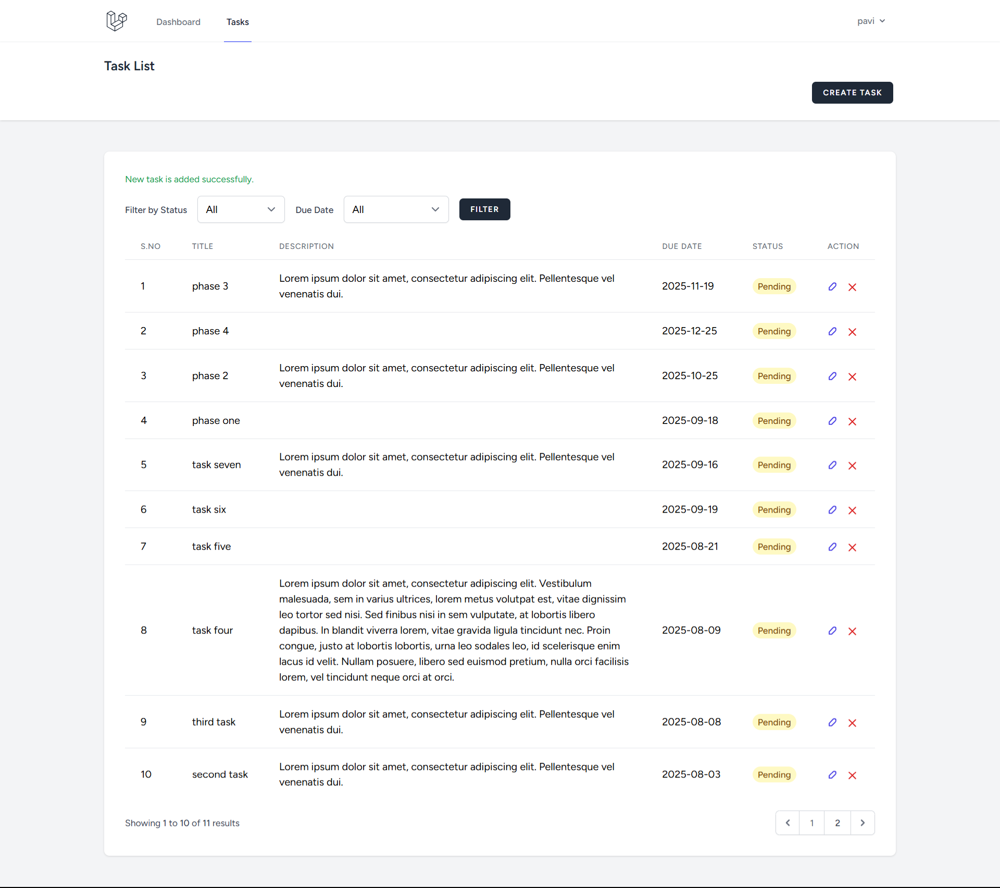
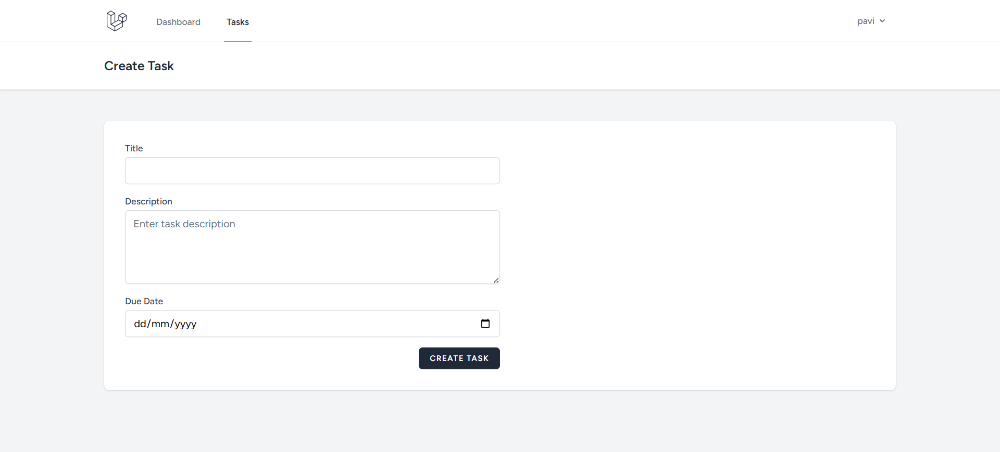
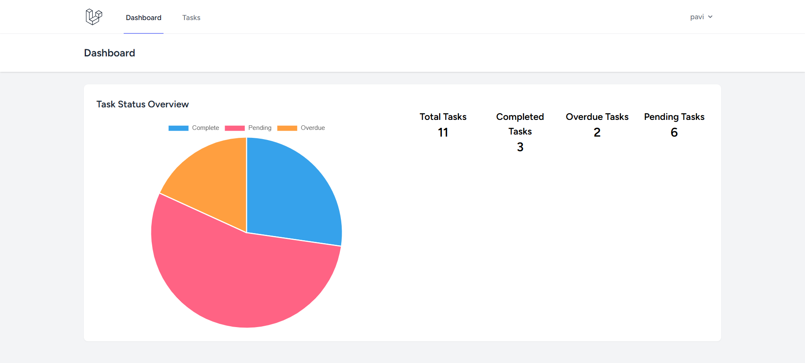

# Laravel Task Management System

A simple Task Management System built with Laravel that allows users to create, update, and manage tasks efficiently. It includes features such as task statuses and a scheduled command to update task statuses daily.

## Features

- User Authentication (Login/Registration)
- Create, Edit, and Delete Tasks
- Set Task Status (pending, completed, overdue)
- Set Due Dates
- Daily Scheduler to Update Task Status
- Responsive UI with Blade and Tailwind CSS
- Graphical representation (Chart.js) Pie chart to show task status

## Tech Stack

- PHP >= 8.1
- Composer
- Laravel >= 10
- MySQL or other supported DB
- Node.js & npm (for compiling assets)

## Installation

1. **Clone the repository**

git clone https://github.com/sathish447/toDoApp.git
cd toDoApp

## Install dependencies
composer install
npm install && npm run dev

##  Environment setup
cp .env.example .env
php artisan key:generate

##  Set up your database
DB_CONNECTION=mysql
DB_HOST=127.0.0.1
DB_PORT=3306
DB_DATABASE=todoapp
DB_USERNAME=root
DB_PASSWORD=

## Scheduled Command
php artisan schedule:run
php artisan tasks:update-status

##  Usage Login Cred
Email : adam@test.com
Passworg : Abc@1234

Email : james@test.com
Passworg : Abc@1234

Email : daniel@test.com
Passworg : Abc@1234

## 📸 Screenshots

### Dashboard

### Create Task

### Task Status Chart

## Running Tests

Run feature tests with:
php artisan test
